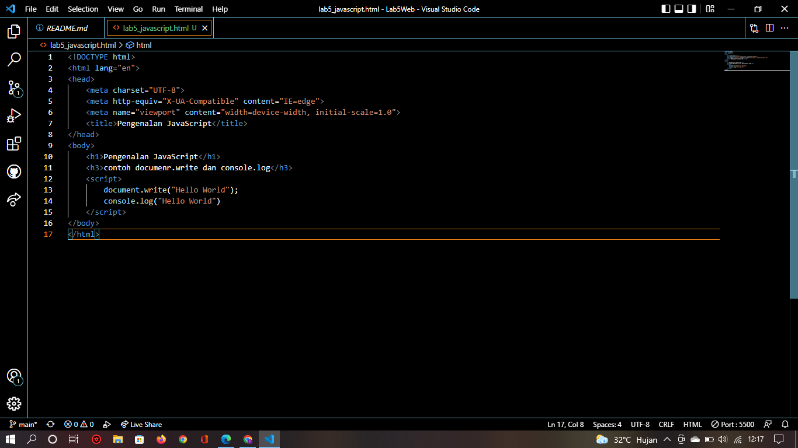
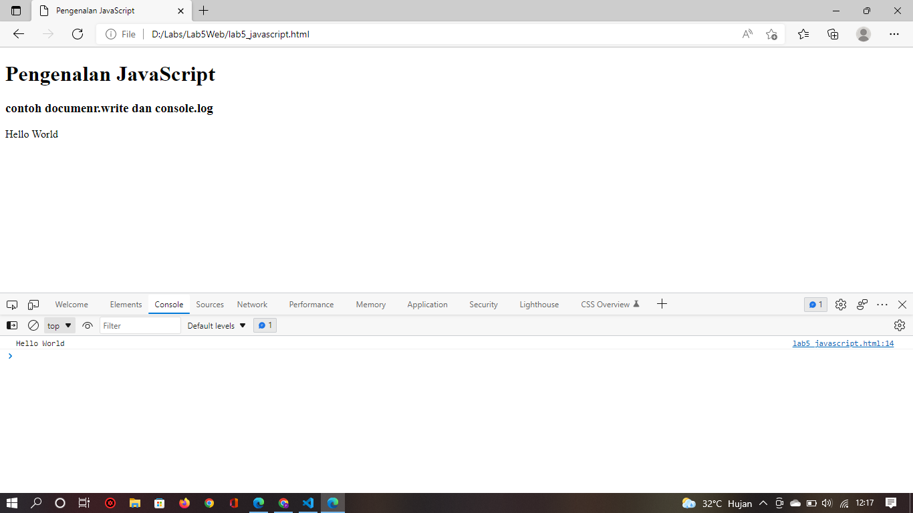
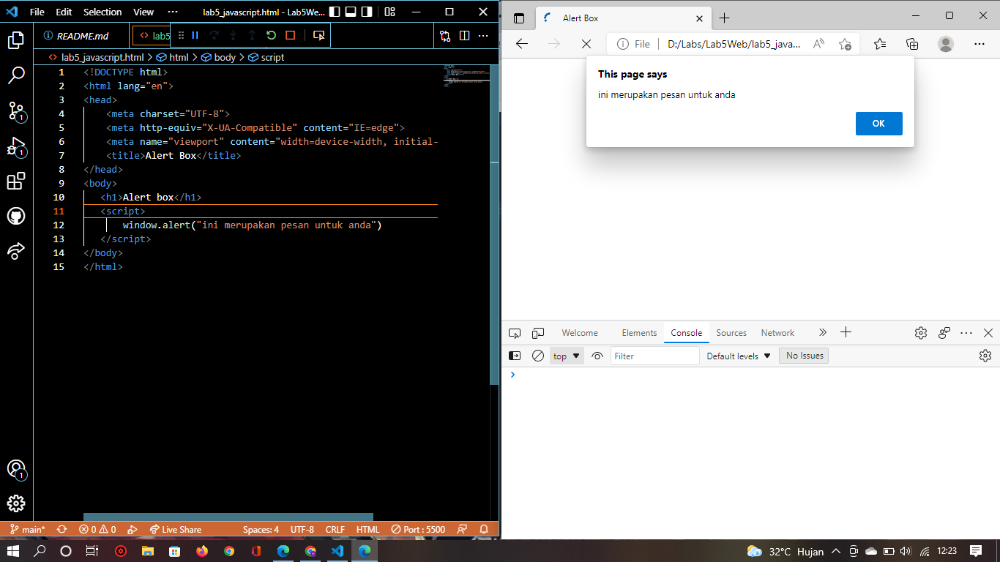
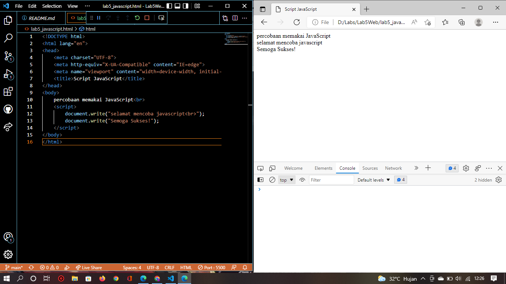
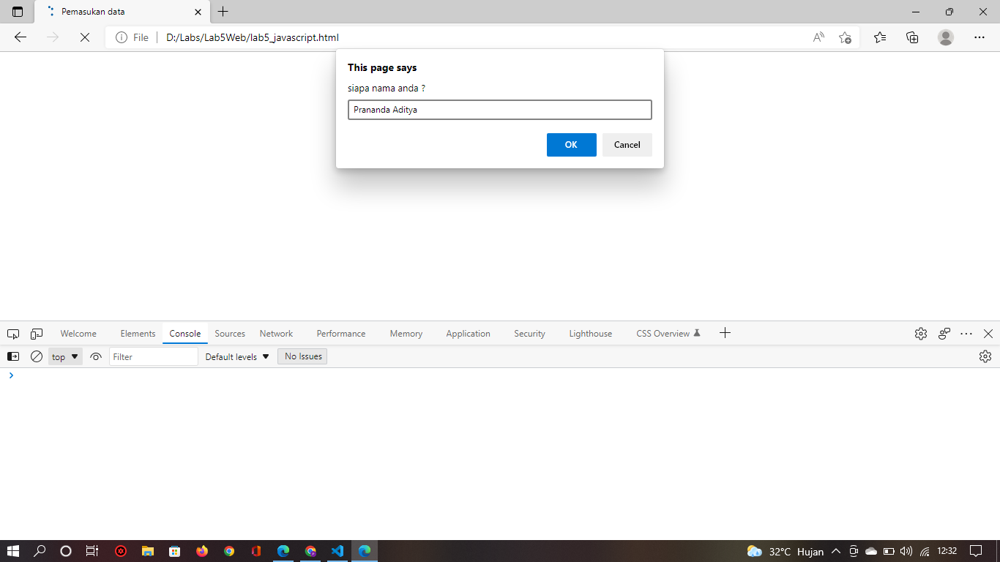
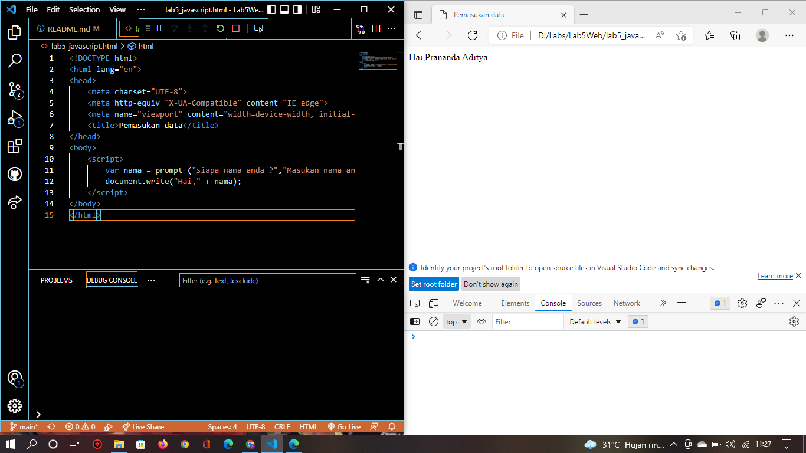
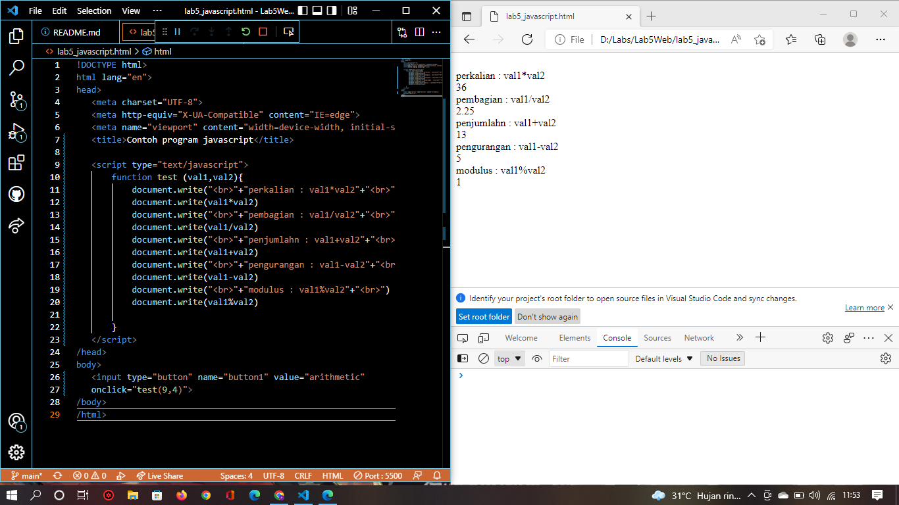
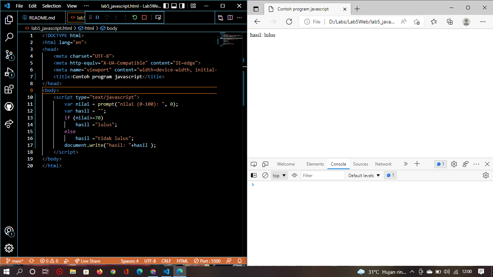
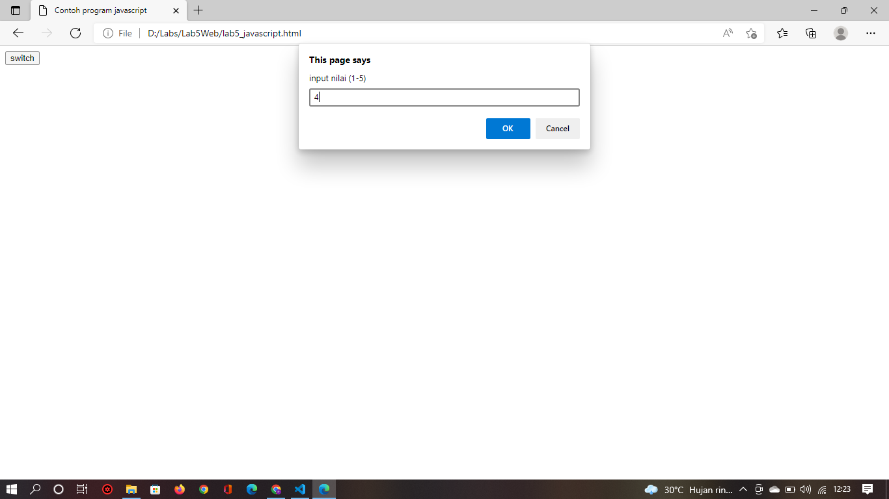
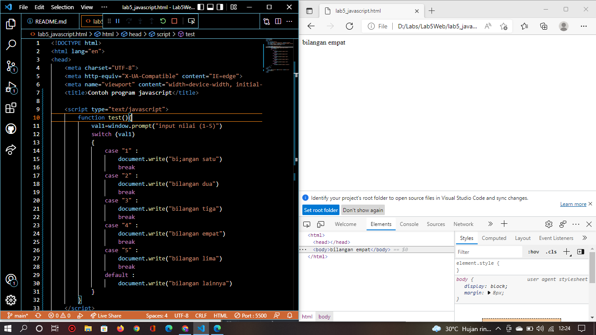

# Langkah-langkah Praktikum 5
 Persiapan membuat dokumen HTML dengan nama file lab5_javascript.html seperti berikut.

# 1. Javascript Dasar
 Pemakaian alert sebagai property window.

 Pemakaian method dalam objek

 Pemakaian Prompt

# 2. Dasar Pemograman Di Javascript
 Operasi dasar aritmatika

 Seleksi kondisi(if..else)
 disini saya memasukan data 75

 Penggunaan operator switch untuk seleksi kondisi

# 3. Pembuatan Form